# 🎓 Assignment Portal - Microservices Documentation


This repository contains a comprehensive assignment management system built with **microservices architecture**. The system consists of three main microservices that work together to provide assignment management, RAG-based assistance, and email notification capabilities.

## 🏗️ System Architecture Overview

```mermaid
graph TB
    subgraph "Client Layer"
        WEB[🌐 Web Frontend]
        MOB[📱 Mobile App]
        API_CLIENT[🔧 API Client]
    end
    
    subgraph "API Gateway"
        GATEWAY[🚪 Load Balancer/Gateway]
    end
    
    subgraph "Microservices"
        ASSIGN[📚 Assignment-API<br/>Port: 8080<br/>Auth & Assignment Management]
        RAG[🤖 RAG-Service<br/>Port: 8001<br/>AI-Powered Assistance]
        EMAIL[📧 Email-Service<br/>Port: 3000<br/>Notification System]
    end
    
    subgraph "Data Layer"
        POSTGRES[(🐘 PostgreSQL<br/>User & Assignment Data)]
        QDRANT[(🔍 Qdrant Vector DB<br/>Document Embeddings)]
        REDIS[(⚡ Redis<br/>Session Cache)]
    end
    
    subgraph "External Services"
        SMTP[📮 SMTP Server]
        LLM[🧠 LLaMA/GPT API]
        PROMETHEUS[📊 Prometheus]
    end
    
    WEB --> GATEWAY
    MOB --> GATEWAY
    API_CLIENT --> GATEWAY
    
    GATEWAY --> ASSIGN
    GATEWAY --> EMAIL
    
    ASSIGN --> POSTGRES
    ASSIGN --> REDIS
    ASSIGN -->RAG
    ASSIGN -.-> EMAIL
    
    RAG --> QDRANT
    RAG --> LLM
    
    EMAIL --> POSTGRES
    EMAIL --> SMTP
    EMAIL --> PROMETHEUS
    
    style ASSIGN fill:#e1f5fe
    style RAG fill:#f3e5f5
    style EMAIL fill:#e8f5e8
```



## ✨ Key Features

### 🎯 **Core Capabilities**

| Feature | Description | Service |
|---------|-------------|---------|
| 👤 **User Management** | JWT-based authentication, role-based access control | Assignment-API |
| 📝 **Assignment Lifecycle** | Create, assign, submit, review assignments | Assignment-API |
| 🤖 **AI-Powered Assistance** | RAG-based document Q&A, context-aware responses | RAG-Service |
| 📧 **Smart Notifications** | Email templates, delivery tracking, analytics | Email-Service |
| 📊 **Analytics & Monitoring** | Prometheus metrics, delivery rates, performance | Email-Service |
| 🔒 **Security** | JWT tokens, input validation, secure file uploads | All Services |

### 🚀 **Advanced Features**

```
┌─────────────────────────────────────────────────────────────────┐
│  🎓 ASSIGNMENT PORTAL - FEATURE MATRIX                         │
├─────────────────────────────────────────────────────────────────┤
│                                                                 │
│  📚 ASSIGNMENT MANAGEMENT          🤖 AI ASSISTANCE             │
│  ├── Multi-role Authentication     ├── Document Embedding       │
│  ├── Branch/Semester Filtering     ├── Vector Search           │
│  ├── File Upload Support          ├── Context-Aware Responses  │
│  ├── Late Submission Tracking     └── LLaMA Integration        │
│  └── Bulk Assignment Operations                                │
│                                                                 │
│  📧 EMAIL SYSTEM                   📊 MONITORING                │
│  ├── SMTP Integration             ├── Prometheus Metrics       │
│  ├── Template Management          ├── Delivery Analytics       │
│  ├── Bounce/Reject Tracking       ├── Performance Monitoring   │
│  ├── Rate Limiting                └── Health Checks            │
│  └── Multi-Admin Support                                       │
│                                                                 │
└─────────────────────────────────────────────────────────────────┘
```

## Getting Started

1. **Clone the repository**
   ```bash
   git clone <repository-url>
   cd assignment-portal
   ```

2. **Set up databases**
   - PostgreSQL for Assignment-API and Email-Microservice
   - Qdrant Vector Database for RAG-Service

3. **Configure environment variables**
   - Create `.env` files in each microservice directory
   - Update with your database and service configurations

4. **Install dependencies**
   ```bash
   # For each microservice
   go mod download
   ```

5. **Run services**
   ```bash
   # Assignment-API
   cd Assignment-api/assignment-portal
   go run main.go

   # RAG-Service
   cd RAG-service
   go run main.go

   # Email-Microservice
   cd email-microservice
   go run main.go
   ```

## 🏛️ Microservices Overview

The Assignment Portal consists of the following microservices:

| Service | Purpose | Technology Stack | Ports |
|---------|---------|------------------|-------|
| 📚 **Assignment-API** | Core assignment management service | Go, Fiber, GORM, PostgreSQL | HTTP: 8080 |
| 🤖 **RAG-Service** | Retrieval-Augmented Generation service | Go, Fiber, Qdrant, LLaMA | HTTP: 8001, gRPC: 50052 |
| 📧 **Email-Microservice** | Email notification and management | Go, Fiber, PostgreSQL, SMTP | HTTP: 3000, gRPC: 50051 |

## Microservices Documentation

---

## 📚 1. Assignment-API

<div align="center">

```
┌─────────────────────────────────────────────────────────────┐
│                    📚 ASSIGNMENT-API SERVICE                │
├─────────────────────────────────────────────────────────────┤
│  🎯 Purpose: Core assignment management & authentication    │
│  🚀 Tech Stack: Go + Fiber + GORM + PostgreSQL            │
│  🌐 Port: 8080 (HTTP)                                      │
│  📁 Location: Assignment-api/assignment-portal/            │
└─────────────────────────────────────────────────────────────┘
```

</div>

**🔧 Core Functionality**: User authentication, assignment lifecycle management, file uploads, and administrative operations with role-based access control.

### API Endpoints

#### Authentication Endpoints

##### POST `/signup`
Register a new user (student or admin).

**Request Body**:
```json
{
  "email": "string",
  "password": "string",
  "role": "user|admin",
  "branch": "string", // Required for students
  "semester": "number" // Required for students
}
```

**Response**:
```json
{
  "user_id": "number",
  "email": "string",
  "role": "string",
  "branch": "string",
  "semester": "number"
}
```

##### POST `/login`
Authenticate user and get JWT token.

**Request Body**:
```json
{
  "email": "string",
  "password": "string"
}
```

**Response**:
```json
{
  "message": "Login successful",
  "token": "jwt_token_string"
}
```

#### Admin Endpoints (Requires Admin Authentication)

##### GET `/admin/getassignments`
Get assignments filtered by branch and semester.

**Query Parameters**:
- `branch` (optional): Filter by branch
- `semester` (optional): Filter by semester

**Response**:
```json
[
  {
    "id": "number",
    "user_id": "number",
    "admin_id": "number",
    "task": "string",
    "status": "pending|accepted|rejected",
    "branch": "string",
    "semester": "number",
    "due_date": "string",
    "created_at": "string",
    "updated_at": "string"
  }
]
```

##### POST `/admin/assignments/accept`
Accept assignments for multiple students.

**Query Parameters**:
- `id`: Comma-separated list of student IDs (e.g., "101,102,103")

**Response**:
```json
{
  "message": "Assignments Accepted"
}
```

##### POST `/admin/assignments/reject`
Reject assignments for multiple students.

**Query Parameters**:
- `id`: Comma-separated list of student IDs
- `reason` (optional): Reason for rejection

**Response**:
```json
{
  "message": "Assignments Rejected"
}
```

##### POST `/admin/assign_assignments`
Assign tasks to students based on branch and semester.

**Request Body**:
```json
{
  "id": "number",
  "admin_id": "number",
  "task": "string",
  "branch": "string",
  "semester": "number",
  "due_date": "string"
}
```

**Response**:
```json
{
  "message": "Assignment assigned successfully",
  "count": "number",
  "Mail Status": "string"
}
```

#### Admin Aid Endpoints

##### POST `/admin/aid/video`
Upload video content for student assistance.

**Content-Type**: `multipart/form-data`

##### POST `/admin/aid/uploadFile`
Upload files for student assistance.

**Content-Type**: `multipart/form-data`

##### GET `/admin/aid/getData`
Get assistance data for admin review.

#### User Endpoints (Requires User Authentication)

##### GET `/user/aid/getVidData`
Get video assistance data for students.

##### GET `/user/aid/upload`
Get help/assistance information.

##### POST `/user/upload`
Upload assignment submission.

**Content-Type**: `multipart/form-data`
**Form Fields**:
- `user_id`: Student ID
- `admin_id`: Admin ID
- `due_date`: Due date in RFC3339 format
- `comments`: Assignment comments
- `image`: Assignment image file
- `file`: Assignment file

**Response**:
```json
{
  "message": "Assignment uploaded successfully"
}
```

##### GET `/user/admins`
Get list of all administrators.

**Response**:
```json
[
  {
    "user_id": "number",
    "email": "string",
    "role": "admin"
  }
]
```

##### GET `/user/assignments/:user_id`
##### GET `/user/assignments`
Get assignments for a specific user.

**Query Parameters**:
- `user_id`: User ID to fetch assignments for

**Response**:
```json
[
  {
    "id": "number",
    "user_id": "number",
    "admin_id": "number",
    "task": "string",
    "status": "string",
    "due_date": "string"
  }
]
```

---

## 🤖 2. RAG-Service

<div align="center">

```
┌─────────────────────────────────────────────────────────────┐
│                     🤖 RAG-SERVICE                          │
├─────────────────────────────────────────────────────────────┤
│  🎯 Purpose: AI-powered document assistance & Q&A          │
│  🚀 Tech Stack: Go + Fiber + Qdrant + LLaMA               │
│  🌐 Ports: 8001 (HTTP) | 50052 (gRPC)                     │
│  📁 Location: RAG-service/                                 │
├─────────────────────────────────────────────────────────────┤
│  🔍 Features:                                              │
│  • Document embedding & vector storage                     │
│  • Semantic search capabilities                            │
│  • Context-aware AI responses                              │
│  • Multi-format file processing                            │
└─────────────────────────────────────────────────────────────┘
```

</div>

**🔧 Core Functionality**: Advanced document processing with vector embeddings, semantic search, and LLM-powered context-aware responses for student assistance.

### API Endpoints

#### HTTP Endpoints

##### POST `/sendFiles`
Upload and embed files for RAG processing.

**Content-Type**: `multipart/form-data`
**Form Fields**:
- `files`: Multiple files to be processed and embedded

**Response**:
```json
{
  "message": "Files embedded and stored successfully"
}
```

##### GET `/getPromptWithContext`
Query the RAG system with context-aware responses.

**Request Body**:
```json
{
  "query": "string"
}
```

**Response**:
```json
{
  "answer": "string"
}
```

#### gRPC Endpoints

##### `UploadFile`
Upload file via gRPC for embedding.

**Request**:
```protobuf
message FileUploadRequest {
  string filename = 1;
  bytes content = 2;
}
```

**Response**:
```protobuf
message FileUploadResponse {
  bool message = 1;
}
```

##### `QueryWithContext`
Query with context via gRPC.

**Request**:
```protobuf
message QueryRequest {
  string query = 1;
}
```

**Response**:
```protobuf
message QueryResponse {
  string answer = 1;
}
```

---

## 📧 3. Email-Microservice

<div align="center">

```
┌─────────────────────────────────────────────────────────────┐
│                   📧 EMAIL-MICROSERVICE                     │
├─────────────────────────────────────────────────────────────┤
│  🎯 Purpose: Smart email notifications & analytics         │
│  🚀 Tech Stack: Go + Fiber + PostgreSQL + Prometheus      │
│  🌐 Ports: 3000 (HTTP) | 50051 (gRPC) | /metrics          │
│  📁 Location: email-microservice/                          │
├─────────────────────────────────────────────────────────────┤
│  📊 Features:                                              │
│  • Multi-SMTP provider support                             │
│  • Email template management                               │
│  • Delivery analytics & monitoring                         │
│  • Bounce/rejection tracking                               │
│  • Rate limiting & throttling                              │
│  • Prometheus metrics integration                          │
└─────────────────────────────────────────────────────────────┘
```

</div>

**🔧 Core Functionality**: Comprehensive email management with delivery tracking, analytics, template system, and real-time monitoring capabilities.

### API Endpoints

#### Authentication Endpoints

##### POST `/register`
Register a new email service user.

**Request Body**:
```json
{
  "username": "string",
  "password": "string"
}
```

**Response**:
```json
{
  "message": "User registered successfully and Analytics created",
  "Created At": "timestamp"
}
```

##### POST `/login`
Login to email service.

**Request Body**:
```json
{
  "username": "string",
  "password": "string"
}
```

**Response**:
```json
{
  "token": "jwt_token_string"
}
```

#### Email Management Endpoints (Requires Authentication)

##### POST `/verify-email-identity`
Verify an email identity for sending.

**Request Body**:
```json
{
  "email": "string",
  "smtp_host": "string",
  "smtp_port": "number",
  "username": "string",
  "app_password": "string",
  "admin_name": "string"
}
```

##### GET `/list-verified-identities`
Get list of verified email identities.

**Response**:
```json
[
  {
    "id": "number",
    "email": "string",
    "smtp_host": "string",
    "smtp_port": "number",
    "verified": true,
    "admin_name": "string"
  }
]
```

##### GET `/list-unverified-identities`
Get list of unverified email identities.

##### DELETE `/delete-identity/:email`
Delete an email identity.

**Path Parameters**:
- `email`: Email address to delete

##### POST `/send-email`
Send email to recipients.

**Request Body**:
```json
{
  "from": "string",
  "to": ["string"],
  "subject": "string",
  "body": "string",
  "format": "html|text"
}
```

**Response**:
```json
{
  "message": "Emails processed successfully"
}
```

##### POST `/create-template`
Create email template.

**Request Body**:
```json
{
  "name": "string",
  "subject": "string",
  "body": "string",
  "format": "html|text"
}
```

#### Metrics Endpoints

##### GET `/email-metrics/:senderEmail`
Get email metrics for a specific sender.

**Path Parameters**:
- `senderEmail`: Email address of sender

**Response**:
```json
{
  "total_emails": "number",
  "delivered": "number",
  "bounced": "number",
  "rejected": "number",
  "delivery_rate": "number",
  "bounce_rate": "number"
}
```

##### GET `/admin-email-metrics/:adminName`
Get aggregated email metrics for an admin.

**Path Parameters**:
- `adminName`: Admin username

##### GET `/metrics`
Prometheus metrics endpoint for monitoring.

**Response**: Prometheus format metrics

#### gRPC Endpoints

The email service also provides gRPC endpoints for internal service communication, particularly for sending assignment-related notifications.

---

## ⚙️ Environment Configuration

<div align="center">

```
┌─────────────────────────────────────────────────────────────┐
│                  ⚙️ CONFIGURATION MATRIX                    │
└─────────────────────────────────────────────────────────────┘
```

</div>

### 📚 Assignment-API
```env
# Database Configuration
DB_HOST=localhost
DB_PORT=5432
DB_USER=username
DB_PASSWORD=password
DB_NAME=assignment_db

# Security
JWT_SECRET=your_jwt_secret

# Server
PORT=8080
```

### 🤖 RAG-Service
```env
# Application
APP_PORT=8001

# Vector Database
QDRANT_URL=http://localhost:6333
QDRANT_COLLECTION=rag-corpus

# AI/LLM Integration
LLAMA_API_URL=your_llama_endpoint
OPENAI_API_KEY=your_openai_key

# gRPC
GRPC_PORT=50052
```

### 📧 Email-Microservice
```env
# Database
DB_HOST=localhost
DB_PORT=5432
DB_USER=username
DB_PASSWORD=password
DB_NAME=email_db

# SMTP Configuration
SMTPHost=smtp.gmail.com
SMTPPort=587
SenderEmail=your_email@gmail.com
Name=your_name
AppPassword=your_app_password

# Service Ports
HTTP_PORT=3000
GRPC_PORT=50051

# Monitoring
PROMETHEUS_PORT=9090
```
